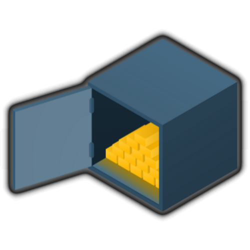

---

layout: col-sidebar
title: OWASP WrongSecrets
tags: wrongsecrets
level: 3
type: tool
pitch: Examples with how to not use secrets

---

OWASP WrongSecrets is the first Secrets Management-focused vulnerable/p0wnable app! It can be used in security trainings, awareness demos, as a test environment for secret detection tools, and bad practice detection tooling.

## Description

WrongSecrets is based on Java, Docker, Terraform, and a bit of scripting fun. It contains more than 20 exercises with various "hidden" secrets - which you need to find.

## Contributors

Leaders:

- [Ben de Haan @bendehaan](https://github.com/bendehaan)
- [Jeroen willemsen @commjoen](https://github.com/commjoen)

Top contributors:

- [Nanne Baars @nbaars](https://github.com/nbaars)
- [Marcin Nowak @MarcinNowak-codes](https://github.com/MarcinNowak-codes)
- [Joss Sparkes @remakingeden](https://github.com/remakingeden)
- [Tibor Hercz @tiborhercz](https://github.com/tiborhercz)
- [Filip Chyla @fchyla](https://github.com/fchyla)
- [Dmitry Litosh @Dlitosh](https://github.com/Dlitosh)
- [Josh Grossman @tghosth](https://github.com/tghosth)
- [Spyros @northdpole](https://github.com/northdpole)
- [Mike Woudenberg @mikewoudenberg](https://github.com/mikewoudenberg)
- [Ruben Kruiver @RubenAtBinx](https://github.com/RubenAtBinx)
- [Finn @f3rn0s](https://github.com/f3rn0s)
- [Alex Bender @alex-bender](https://github.com/alex-bender)
- [Rick M @kingthorin](https://github.com/kingthorin)

Testers:

- [Dave van Stein @davevs](https://github.com/davevs)
- [Marcin Nowak @MarcinNowak-codes](https://github.com/MarcinNowak-codes)
- [Marc Chang Sing Pang @mchangsp](https://github.com/mchangsp)

Special mentions for helping out:

- [Madhu Akula @madhuakula](https://github.com/madhuakula)
- [Björn Kimminich @bkimminich](https://github.com/bkimminich)
- [Avinash Pancham @avinashpancham](https://github.com/avinashpancham)

[Actual contributors at this point in time.](https://github.com/commjoen/wrongsecrets/graphs/contributors)

## Licensing

This program is free software: You can redistribute it and/or modify it
under the terms of the
[MIT License](https://github.com/commjoen/wrongsecrets/blob/master/LICENSE).
OWASP WrongSecrets and any contributions are Copyright © by Jeroen Willemsen & the OWASP WrongSecrets contributors 2020-2022.

## Presentations about OWASP WrongSecrets

The project has been promoted at:

- [AllDayDevOps: Our secrets management journey from Code to Vault](https://www.alldaydevops.com/addo-speakers/jeroen-willemsen)
- [Conf42 DevSecOps 2021: Secrets-management: challenges from code to cloud](https://www.youtube.com/watch?v=EsMS7gOBrY4)
- [Club Cloud 2021: Securing your secrets in the cloud](https://youtu.be/lXMRTP5eg9Q)
- [OWASP Dutch Chapter Meetup: Our Secrets Management Journey: From Code to Vault](https://www.youtube.com/watch?v=qR6JCkZgOlY)
- [Application Security Podcast: Jeroen Willemsen & Ben de Haan -- Dirty little secrets](https://appsecpodcast.securityjourney.com/1730684/9864567-jeroen-willemsen-and-ben-de-haan-dirty-little-secrets)
- [Open Security Summit: OWASP Wrong Secrets: project goals, under the hood, and where do we go from here?](https://www.youtube.com/watch?v=EYkjgGuhOYw)
- [WrongSecrets demo - How not to store secrets with the project founder Jeroen Willemsen](https://www.youtube.com/watch?v=nqzxpgvLEv4&t=709s)
- [Security Journey: Jeroen Willemsen and Ben de Haan - Dirty little secrets](https://www.youtube.com/watch?v=0HGPnQAYFNY)
- [Meetup OWASP Bay Area: OWASP WrongSecrets: how to NOT mange your secrets](https://www.youtube.com/watch?v=oRUPVhp1Bfw)
- [Code to Cloud Virtual Summit: Learn How to (Not) Use Secrets with OWASP WrongSecrets!](https://start.paloaltonetworks.com/code-to-cloud-summit.html)
- [Teqnation 2022 Utrecht](https://teqnation.com/timetable-2022/)
- [Devops Pro Europe: Introducing OWASP WrongSecrets: How You Should NOT Handle Your Secrets](https://devopspro.lt/Jeroen-Willemsen/)
- [OWASP Virtual Appsec Europe 2022: OWASP WrongSecrets: We have a secret for Everyone!](https://whova.com/web/GKSmlhCK%2FWzBY2c8qqJ%2Bp7kNcnjsUQAQJ%2ByBsjLrbOo%3D/Agenda)
- [Tweakers Developers Summit: OWASP WrongSecrets - waar je je applicatiegeheimen (niet) moet neerzetten](https://tweakers.net/partners/devsummit2022/1684/bendehaan/)
- [OWASP Frankfurt #55 In-Person Event: Cloud Secrets,Cyber-Crime & Threat Modeling: Can't you keep a secret? Learn Secrets Management with OWASP WrongSecrets by Dan Gora, OWASP Frankfurt](https://www.meetup.com/nl-NL/it-security-stammtisch-frankfurt-owasp-u-w/events/286925136/)

Soon to come:

TBA

We would like to thank many people that have given a shoutout or a share about this project! Thank you for your forum-posts, blogs, and more!
