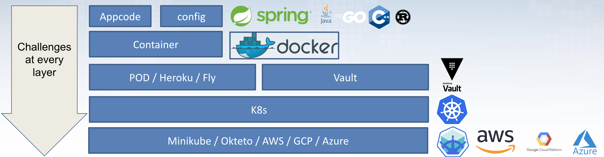

## Overview

The application can best be run as a [Docker container](https://hub.docker.com/r/jeroenwillemsen/wrongsecrets) as part of a K8s cluster. Some challenges are unique to specific public clouds (AWS, GCP, and Azure only for now).

The overview above nicely shows which technologies are mostly used to build up the full application. Consult the [GitHub repo readme](https://github.com/OWASP/wrongsecrets) for more information.
