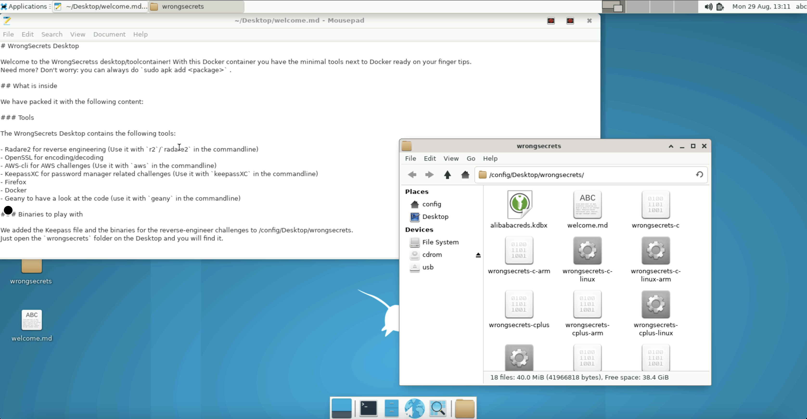

## Wrongsecrets Desktop
[](https://img.shields.io/docker/pulls/jeroenwillemsen/wrongsecrets-desktop.svg)

Want to try out the secrets-hunting, but don't want to install all the recommended tools? Try to use our [WrongSecrets desktop](https://hub.docker.com/r/jeroenwillemsen/wrongsecrets-desktop).



You can run all the tools and a desktop environment in a container by doing the following:

```shell
docker run -p 3000:3000 jeroenwillemsen/wrongsecrets-desktop:latest
```

and open a browser at [http://localhost:3000](http://localhost:3000). 
Want to know more? Checkout the [Readme at the WrongSecrets github repo](https://github.com/OWASP/wrongsecrets#want-to-play-but-are-not-allowed-to-install-the-tools).
